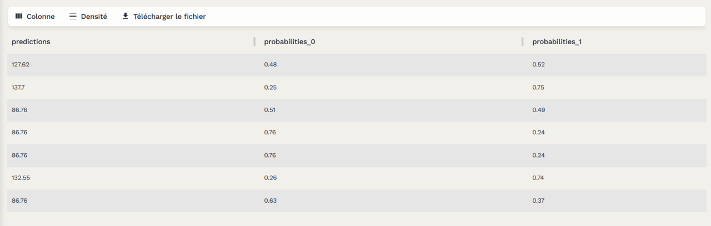

# PrimePredict


## Description 
ICI  Ce dépôt contient le développement d'un modèle de machine learning avancé destiné à prédire le total des paiements de sinistres d'assurance. Notre méthode est conçue pour faciliter le calcul des primes annuelles matérielles pour un jeu de données comprenant 48 045 contrats d'assurance pour l'année 2011.

## Objectif
L'objectif principal de ce projet est de calculer les primes annuelles matérielles pour l'ensemble de données fourni. Pour atteindre cet objectif, nous adoptons une approche de modélisation en deux étapes qui prédit à la fois le coût des dommages matériels et la fréquence des incidents matériels.

## Modèles
Nous développerons et évaluerons les modèles suivants :

1. **Modèle d'Estimation des Coûts Matériels :** Ce modèle sera formé pour estimer les coûts associés aux dommages matériels résultant d'incidents.
2. **Modèle de Prédiction de la Fréquence des Incidents Matériels :** Ce modèle vise à prédire la fréquence des incidents causant des dommages matériels.

## Calcul de la Prime
La Prime Prédite est calculée en utilisant la formule suivante :

Prime Prédite = Prime moyen + Fréquence des Incidents * Coût Prédit de degats * N. clients avec incidents / N. clients sans incidents

## Structure du Dépôt

- **.github/workflows/** : Contient les fichiers de configuration pour les workflows GitHub Actions utilisés pour l'intégration continue et le déploiement continu.
- **argo_workflow/** : Dossiers des configuration yaml permattant de lancer des entraînements en parallèle.
- **app/** : Code source de l'application principale, y compris les améliorations pour le score pylint.
- **argocd/** : Fichiers de configuration pour Argo CD, utilisé pour le déploiement déclaratif des applications dans Kubernetes.
- **kubernetes/** : Contient les fichiers de configuration Kubernetes, y compris les fichiers ingress pour la gestion du trafic réseau.
- **models/** : Dossiers pour les modèles entraînés, y compris les fichiers pour la gestion et le suivi des modèles.
- **notebooks/** : Jupyter notebooks pour l'analyse exploratoire des données et les tests de validation des modèles.
- **src/** : Code source du projet contenant les scripts de prétraitement des données, les définitions des modèles, et plus.
- **unit_test/** : Tests unitaires pour vérifier la fonctionnalité des modules de code.
- **Dockerfile** : Fichier Docker pour construire les images des conteneurs utilisés dans le projet.
- **README.md** : Document principal fournissant une vue d'ensemble et des instructions détaillées pour le dépôt.
- **MLproject** : Fichier permettant de lancer des entraînements sur MLflow dans un format mlflow project. 
- **requirements.txt** : Liste toutes les dépendances Python nécessaires pour le projet.

## Accès API:
Vous trouverez notre API dans le lien suivant : 

**https://primepredict-api.lab.sspcloud.fr/**

Pour faire des requêtes : 

**https://primepredict-api.lab.sspcloud.fr/docs**


## Pour Commencer

Pour utiliser ce projet, suivez ces étapes :

1. **Cloner le dépôt :**
   ```bash
   git clone https://github.com/AhmedProj/PrimePredict.git
2. **Accéder au dépôt et installer les packages nécessaires :**
   ```bash
   cd PrimePredict
   pip install -r requirements.txt
3. **Définir des variables d'environnement pour utiliser MLflow :**
   ```bash
   export MLFLOW_MODEL_FREQ_NAME="model_freq"
   export MLFLOW_MODEL_FREQ_VERSION=1 
   export MLFLOW_MODEL_REG_NAME="model_reg"
   export MLFLOW_MODEL_REG_VERSION=1 

   export MLFLOW_EXPERIMENT_NAME="experience"

5. **Lancer l'entraînement après definition des hyperparamètres dans MLproject et en se placant dans le fichier racine:**
   ```bash
   mlflow run . --env-manager=local \
    -P remote_server_uri=$MLFLOW_TRACKING_URI \
    -P experiment_name=$MLFLOW_EXPERIMENT_NAME

6. **Lancer l'entraînement parallélisé avec argo workflow avec la commande:**
   ```bash
   argo submit argo_workflows/workflow.yml

## ETL des logs

Pour une bonne gestion de l'API on a ajouté un suivi des logs (probabilité de prédiction du premier modèle de notre pipeline) après une extraction du fichier des logs et une transformation on envoie ces logs en format parquet vers S3.


## Tests

Pour exécuter les tests unitaires dans le dossier unit_test, utilisez la commande suivante :
```bash
python file.py
